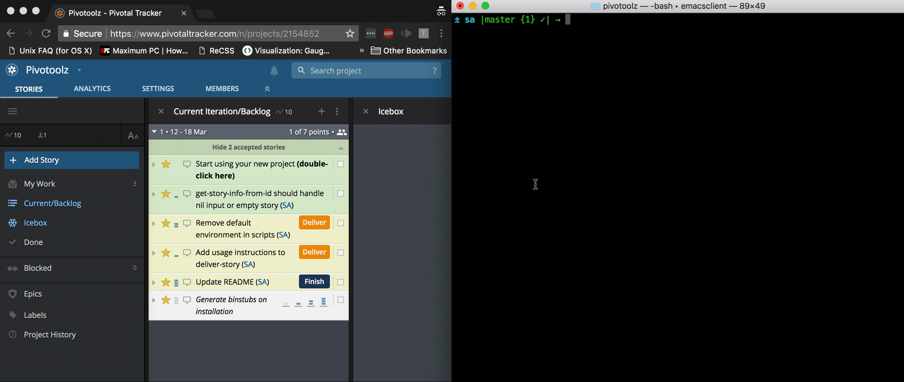
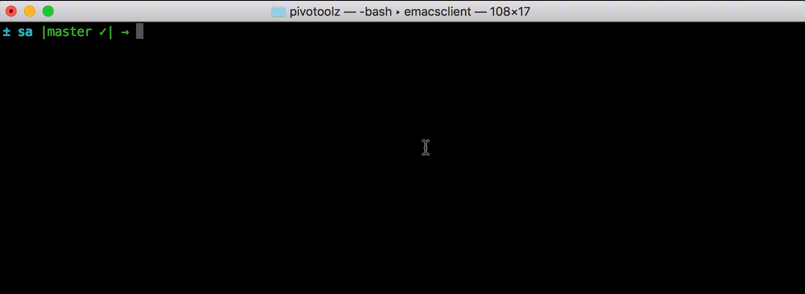

# Pivotoolz

Ever forget to deliver a story while waiting for your continuous
deployment build to go green and deployment to finish? Never let
another story slip through the cracks into production again with
Pivotoolz! Ever wish stories would deliver themselves on successful
deployment? This gem is for you!

Pivotoolz is a set of tools to automate your development process when
using Pivotal Tracker for managing your backlog. Save yourself time
and increase your productivity. Use the tools individually or compose
them together to automate anything related to pivotal tracker stories.

## Installation

Add this line to your application's Gemfile:

```ruby
gem 'pivotoolz'
```

And then execute:

    $ bundle

Or install it yourself as:

    $ gem install pivotoolz

To take full advantage of the tools, ensure you have the following
environment variables set:
```bash
PIVOTAL_TRACKER_API_TOKEN  # Get this from your pivotal tracker account profile page
SLACK_WEBHOOK_URL          # Get this by creating a new Incoming Webhook integration in Slack
```

Set the environment variables by either adding them to your `.bashrc` file
or exporting them prior to usage:
Set the environment variables by exporting them with the following commands:
`export PIVOTAL_TRACKER_API_TOKEN=YOUR_TOKEN`
`export SLACK_WEBHOOK_URL=YOUR_WEBHOOK_URL`

Alternatively, you can simply add those export statements to your `.bashrc` file
so that you won't have to keep typing it every time you want to use
`post-slack-message` or `deliver-deployed-stories` and their ilk.

## Usage

Pivotoolz is a collection of tiny programs that can be used individually
or composed together for more powerful features. The manner of usage of
each is described below:

### `deliver-deployed-stories`

Deliver all stories that have been deployed to the given
environment since the previous and last deployment.

Example:
`deliver-deployed-stories ENVIRONMENT`

Where `ENVIRONMENT` is the environment you consider to be where stories
can be accepted/rejected.

Example:
Let's say we have an `acceptance` environment where we deploy our app to
test out stories. As long as we label our deployed git SHAs with tags
(using `tag-it`), we can automatically deliver any finished stories
that went out in the last deployment by simply running the command:

`deliver-deployed-stories acceptance`

Add the command to your deployment process to have your stories automatically delivered
on a successful deployment.



### `deliver-story`

Deliver a given story provided in JSON format. The minimum JSON attributes
required are `id` and `current_state`

Typically used with output from `get-story-info-from-id` piped in.

Example:
`get-story-info-from-id STORY_ID | deliver-story`
  OR
`deliver-story '{"id": 123, "current_state": "finished"}'`

If `current_state` is not `finished`, the story will not be delivered.

### `story-ids-deployed`

Returns a newline delimited list of all story ids deployed
to the given environment.

Example:
```
story-ids-deployed production

# Output:
123
456

```


### `merge`

Tired of running multiple commands to merge your branch when all you
really want to do is 'just merge' your branch? Now you can!
Just run `merge TARGET_BRANCH` where target branch is the branch
you want to merge into. The `merge` program takes care of rebasing the
latest local and upstream changes from target branch into your branch,
pushing your rebased branch, and then merging with the `--no-ff` flag.
Life is short, the time saved adds up real fast!

Example:
When in a branch you want to merge, just run
`merge master` to merge it into the `master` branch. You will end up
with a clean git history and all commits in your branch will be bundled
nicely under a top-level merge commit.


### `tag-it`

Tag the current git HEAD with a given tag (usually environment you're about to deploy to).

Example:
`tag-it production` - Will tag the current git HEAD with `production/TIMESTAMP`


### `stories-deployed`

If you use `tag-it` to label your git SHAs for deployment, this will return a list
of all stories deployed between the previous and last deployments using the tags to
scan a commit range.

Example:
```
stories-deployed production  # You may need to prepend bundle exec depending on your setup
# Output:

Update README:
https://www.pivotaltracker.com/story/show/123

Update dependencies
https://www.pivotaltracker.com/story/show/456

```


Use with `post-slack-message` to post a message in a slack deployment channel
with the list of stories that just got deployed.

### `post-slack-message`

Post a message to a slack channel. You will need to [setup
a webhook integration](https://api.slack.com/incoming-webhooks) on slack first.
Once you have done so, copy your Webhook URL into
an environment variable `SLACK_WEBHOOK_URL`.
If the `SLACK_WEBHOOK_URL` has been defined correctly, you will
be able to post a message in slack to any channel as follows:
```bash
post-slack-message CHANNEL "MESSAGE_TEXT"
```
Where CHANNEL is of the form "#channel" or "@user".

You can also pipe a message to the `post-slack-message` program. For
example:
```bash
{ echo Stories deployed to production:; stories-deployed production; } | post-slack-message '#production-deploys'
```

`post-slack-message` can be helpful if you just want to have fun trolling your co-workers too.



### `pv-git-branch`

Wouldn't it be nice to have all your Git branch names consistent with your dev team? Well now
you can with `pv-git-branch`. Just pass `pv-git-branch` a Pivotal Story ID as a string, and it will create a new
branch for you based on author name, the pivotal story category, the pivotal story
name and the pivotal story id.
Be sure to set your `PIVOTAL_TRACKER_API_TOKEN` env variable in your `.bashrc` file. If you want to explicitly set your initials as the author name,
set your git config user initials like this: `git config --add user.initials af`. Otherwise it
will take your `git config user.name` or `whoami` information.

Example:
```bash
pv-git-branch "#111222333"
```
This would create and checkout a new branch: `af/features/building-someting-great-111222333`.

If the branch had already been created, the command will automatically check out existing branch.


## Development

After checking out the repo, run `bin/setup` to install dependencies. Then, run `rake spec` to run the tests. You can also run `bin/console` for an interactive prompt that will allow you to experiment.

To install this gem onto your local machine, run `bundle exec rake install`. To release a new version, update the version number in `version.rb`, and then run `bundle exec rake release`, which will create a git tag for the version, push git commits and tags, and push the `.gem` file to [rubygems.org](https://rubygems.org).

## Contributing

Bug reports and pull requests are welcome on GitHub at https://github.com/sufyanadam/pivotoolz. This project is intended to be a safe, welcoming space for collaboration, and contributors are expected to adhere to the [Contributor Covenant](http://contributor-covenant.org) code of conduct.

## License

The gem is available as open source under the terms of the [MIT License](https://opensource.org/licenses/MIT).

## Code of Conduct

Everyone interacting in the Pivotoolz project’s codebases, issue trackers, chat rooms and mailing lists is expected to follow the [code of conduct](https://github.com/sufyanadam/pivotoolz/blob/master/CODE_OF_CONDUCT.md).

## Contributors

- [Sufyan Adam](https://github.com/sufyanadam)
- [Aaron Fry](https://github.com/netsprout)
- [Alessandro Metta](https://github.com/n0f3)
